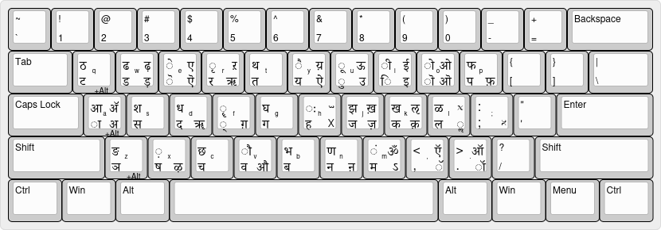

# Files collected from or created for St. John's

A collection of various files related to St. John's classes, reading groups,
or just general education in that vein.

**Table of Contents:**

<!--toc:start-->

- [Admin Documents](#admin-documents)
- [Seminar Readings](#seminar-readings)
  - [Dhvanyāloka](#dhvanyāloka)
  - [Tale of the Heike](#tale-of-the-heike)
  - [Dōgen](#dōgen)
- [Precept Readings](#precept-readings)
  - [Tale of Genji](#tale-of-genji)
- [Kumulipo Reading Group](#kumulipo-reading-group)
- [Languages](#languages)
  - [Loading Dictionary files onto your phone](#loading-dictionary-files-onto-your-phone)
  - [Using Dictionary files on your computer](#using-dictionary-files-on-your-computer)
  - [Arabic](#arabic)
    - [Arabic Dictionary Websites](#arabic-dictionary-websites)
    - [Arabic Dictionary Files](#arabic-dictionary-files)
  - [Sanskrit](#sanskrit)
    - [Sanskrit Grammar Reference Tables](#sanskrit-grammar-reference-tables)
    - [Sanskrit Dictionary Websites](#sanskrit-dictionary-websites)
    - [Sanskrit Dictionary Files](#sanskrit-dictionary-files)
    - [Devanagari Transliteration Schemes](#devanagari-transliteration-schemes)
    - [Devanagari Keyboard Layouts](#devanagari-keyboard-layouts)
    - [Nāgārjuna Chapter 25 packet](#nāgārjuna-chapter-25-packet)
    - [Scharf's Rāmopākhyāna](#scharfs-rāmopākhyāna)
  - [Chinese](#chinese)
    - [Chinese Poetry Glosses/Trots/Cribs Notebook](#chinese-poetry-glossestrotscribs-notebook)

## Admin Documents

`admin-docs` will contain miscellaneous useful files that aren't for one
specific course. For example, the Eastern Classics Reading list created in TeX:
[admin-docs/MAEC-Reading-List-2024-2025.pdf](admin-docs/MAEC-Reading-List-2024-2025.pdf)
and it's [source TeX file](admin-docs/MAEC-Reading-List.tex)

## Seminar Readings

### Dhvanyāloka

While writing a paper on the Dhvanyāloka I typeset the original terms sheet
provided in the Eastern Classic Manual -
[dhvanyAloka/dhvanyAloka-terms-orig.tex](dhvanyAloka/dhvanyAloka-terms-orig.tex) and [the PDF output](dhvanyAloka/dhvanyAloka-terms-orig.pdf).
And then I converted some of the terms into a table format -
[dhvanyAloka/dhvanyAloka-terms.tex](dhvanyAloka/dhvanyAloka-terms.tex) ([PDF output](dhvanyAloka/dhvanyAloka-terms.pdf)).

And then I went pretty overboard with my updated version
[dhvanyAloka/dhvanyAloka-terms-additional.tex](dhvanyAloka/dhvanyAloka-terms-additional.tex)
([and PDF output](dhvanyAloka/dhvanyAloka-terms-additional.pdf))
is very much a rough draft and contains far too many terms,
as well as some incorrect definitions I think. Please see .tex file for the
many, many TODO notes contained.

To remain as consistent as possible, all `definitions' were taken directly from
the text provided in the manual, not a dictionary (unless marked as such).

### Tale of the Heike

I copied the character list from our text along with some maps and diagrams -
[heike-ref/heike-ref.tex](heike-ref/heike-ref.tex) ([PDF output](heike-ref/heike-ref.pdf))

### Dōgen

I tried out [https://github.com/moste00/PDF-Indexer](https://github.com/moste00/PDF-Indexer)
on the Dōgen text we read, to see what it would produce.
Typeset results - [.tex file](dogen/heart-dogen-index.tex) and [PDF output](dogen/heart-dogen-index.pdf).
It is marginally useful in class to find a quote you are thinking of,
but way too extensive for easy use. Would be better to create my own word list,
and only return pages for those words. Project for another time...

## Precept Readings

### Tale of Genji

I combined the character list from the Seidensticker translation with the
character list and more information from the Tyler translation.
Added the genealogical chart that Mr. Venkatesh emailed out,
and made a table of the difference in Chapter name translations between the two
translations used by either precept group.
[genji-ref/genji-ref.tex](genji-ref/genji-ref.tex) ([PDF output](genji-ref/genji-ref.pdf))

## Kumulipo Reading Group

I am facilitating a reading group on the Kumulipo and have the source text here
[kumulipo/kumulipo-interlinear.md](kumulipo/kumulipo-interlinear.md),
which I am working to further interlinearize.

## Languages

### Loading Dictionary files onto your phone

Get an app that can load StarDict or mdict formatted files.
I've tried these apps on iPhone, they may have Android equivalents,
I haven't looked:

- [Dicty](https://apps.apple.com/us/app/dicty/id969045273)
  is a free dictionary app for iPhone that can load StarDict formatted files.
  Not sure about other formats.
- [Dictionary Universal](https://apps.apple.com/us/app/dictionary-universal/id312088272)
  is $6, but I got it because Dicty wasn't returning all the Sanskrit words
  when I typed them using English letters, and this app did.
  Not sure if it is worth it for Arabic dictionary files, try the free app first.
  This app does work well (in my limited testing) with Arabic dictionary files.

Then get some dictionary files. See sections below for specific languages.
StarDict dictionaries should usually have 3 files:
`.ifo` (info file),
`.idx` (index file),
`.dict` (dictionary data file).
And they should be loaded into the app as the compressed (zip) file -
do not extract the files unless the app specifically says to do so.

### Using Dictionary files on your computer

I've found [GoldenDict-ng](https://xiaoyifang.github.io/goldendict-ng/install/)
to be the best dictionary application.
It is the "next generation" of GoldenDict, which is no longer maintained.

### Arabic

#### Arabic Dictionary Websites

[Perseus has Lane's Lexicon, this link is chunked by roots](https://www.perseus.tufts.edu/hopper/text?doc=Perseus:text:2002.02.0015).
Another [Lane's Lexicon](https://lexicon.quranic-research.net/index.html),
with more additions and/or corrections maybe?
And some [XML files from Perseus](https://github.com/laneslexicon/lexicon_xml)
with someone's (?) additions.

Here are windows and mac installers for an
[offline application of Perseus's Lane's Lexicon](https://github.com/laneslexicon/lexicon/releases).
And some [documentation on how to use it](https://laneslexicon.github.io/lexicon/site/introduction/intro/).

[A number of Arabic dictionaries/lexicons as PDFs](https://lanelexicon.com/arabic-lexicons/)

#### Arabic Dictionary Files

The [downloads page on this website](https://abu-dju.github.io/dl.html)
has Lane's Lexicon, Salmoné's, and Al-Mawrid Arabic-English Dictionary, but
they are compressed in .7z format, which Dictionary Universal doesn't support.
So you need to extract the files and then compress them in a .zip file first.
I have not tested if the .7z file work in Dicty.

To use these files, please see
[Loading Dictionary files onto your phone](#loading-dictionary-files-onto-your-phone)
or [Using Dictionary files on your computer](#using-dictionary-files-on-your-computer)

### Sanskrit

I've collected a number of random resources for Sanskrit study here.
Dictionaries, and how to use them on desktop or mobile devices,
are in their own sections below.

Here is a list of all of the
[Clay Sanskrit Library's texts](https://claysanskritlibrary.org/volumes/)
(the equivalents of the Loeb Classical Library).

The
[Digital Corpus of Sanskrit (DCS)](http://sanskrit-linguistics.org/dcs/index.php)
is a wonderful, if a bit confusing, resource.
If you click on a line of text (which looks just like regular text...),
you will get a breakdown in CoNLL-U format of the un-sandhied words in that
line, with grammar information.
You can also click on each broken-apart word and get definitions of it and
occurrences of it in the current text and all texts in the corpus.
Here is their
[list of all texts in the corpus](http://sanskrit-linguistics.org/dcs/index.php?contents=corpus)
For example, here is
[Chapter 1 of Nāgārjuna's Mūlamadhyamakārikāḥ](http://sanskrit-linguistics.org/dcs/index.php?contents=texte&PhraseID=388393)
or a linked list of
[all instances of 'has' / हस् (verb: to laugh at) in the Mahābhārata](http://sanskrit-linguistics.org/dcs/index.php?contents=fundstellen&IDWord=158488&IDText=154)

There are more texts avaiable at the
[Göttingen Register of Electronic Texts in Indian Languages (GRETIL)](https://gretil.sub.uni-goettingen.de/gretil.html)

#### Sanskrit Grammar Reference Tables

I originally copied the tables from the book, or retyped them myself, but after
a while I wanted a more complete reference sheet.

I found the [Sanskrit Garden of Paradigms](https://www.yesvedanta.com/sanskrit/garden/)
to be incredibly useful. Also look at the
[Fancy Sanskrit Grammar Tables](https://www.yesvedanta.com/sanskrit/tenses/)
to remind you of more details. The two tables reference each other.

A classmate had the
_The Little Red Book of Sanskrit Paradigms (with a yellow cover)_
which I scanned and will upload once I format it.
It is based on
[The Little Red Book of Sanskrit Paradigms](https://archive.org/details/the-little-red-book/mode/2up)
and is (mostly?) just a condensing of the text into fewer pages.

#### Sanskrit Dictionary Websites

Monier-Williams and other dictionaries are available online at the
[Cologne Digital Sanskrit Dictionaries Site](https://www.sanskrit-lexicon.uni-koeln.de/).
But this can be a bit clunky on a phone.

#### Sanskrit Dictionary Files

I found a number of dictionaries available at
[indic-dict/stardict-sanskrit](https://github.com/indic-dict/stardict-sanskrit),
but I found the instructions a bit confusing.

You can find Sanskrit dictionary files here:
[indic-dict/stardict-sanskrit's index of dictionary files](https://raw.githubusercontent.com/indic-dict/stardict-sanskrit/gh-pages/sa-head/en-entries/tars/tars.MD)
(which was copied from : [indic-dict/stardict-index's larger index of indexes](https://raw.githubusercontent.com/indic-dict/stardict-index/master/dictionaryIndices.md))
and download the [Monier-Williams compressed file](https://github.com/indic-dict/stardict-sanskrit/raw/gh-pages/sa-head/en-entries/tars/mw-cologne__2024-01-17_03-14-56Z__14MB.tar.gz)

To use these files, please see
[Loading Dictionary files onto your phone](#loading-dictionary-files-onto-your-phone)
or [Using Dictionary files on your computer](#using-dictionary-files-on-your-computer)

#### Devanagari Transliteration Schemes

There are a few transliteration schemes for Sanskrit, see
[Wikipedia's Comparison Table](https://en.wikipedia.org/wiki/Devanagari_transliteration#Transliteration_comparison).

Your textbook will likely teach IAST. This is easy to remember & write but hard
to type, e.g. when searching for words online in the [Monier-Williams dictionary](https://www.sanskrit-lexicon.uni-koeln.de/scans/MWScan/2020/web/webtc1/index.php).
That websites use SLP1 - where every Devanagari character is written in a
single roman alphabet letter - for example:
ड (ḍ in IAST) is typed as 'q',
and ढ (ḍh in IAST) is typed as 'Q'

#### Devanagari Keyboard Layouts

There are a few different keyboard layouts to choose from to be able to type Devanagari characters.
If you install a devanagari keyboard on your computer,
try Right-Alt and Right-Alt+Shift to get the various less common characters.

I settled on the Layout: Indian, Variant: Sanskrit (KaGaPa, Phonetic)

I created an image using
[Keyboard Layout Editor which shows the mapping from English to Devanagari characters][KLE-sanskrit]

> [!NOTE]
> The center of each key has the original english letter just for reference.
> 
> On the left side of each key are the Devanagari letters for a Shift+key-press (in upper-left corner) 
> and a normal key-press (in lower-left corner).
> e.g. Instead of 'Q' vs 'q', this keyboard layout would output: 'ठ' and 'ट'
> 
> On the right side of each key are the Devanagari letters when you also hold down the Right-Alt key 
> i.e. for a Right-Alt+Shift+key-press and a Right-Alt+key-press

In this repo there is also the [.json output file from that website](sanskrit/devanagari-keyboard-map-KLE.json)
and [an easier to read .txt file](sanskrit/devanagari-keyboard-map.txt).

#### Nāgārjuna Chapter 25 packet

In class we used a photocopy of Chapter 25 of Nāgārjuna's Mūlamadhyamakakārikā.

My hope is to have at least some chapters of Nāgārjuna formatted in the
[Scharf/Rāmopākhyāna](https://bookshop.org/p/books/ramopakhyana-the-story-of-rama-in-the-mahabharata-a-sanskrit-independent-study-reader-peter-scharf/10187068)
style. But that hasn't happened yet.

In the meantime a PDF of the scanned packet we used in class is available here:
[nagarjuna-ch25.pdf](sanskrit/nagarjuna-ch25.pdf)

#### Scharf's Rāmopākhyāna

A PDF of the quick reference guide I compiled from the Introduction of the
[Scharf's Rāmopākhyāna](https://bookshop.org/p/books/ramopakhyana-the-story-of-rama-in-the-mahabharata-a-sanskrit-independent-study-reader-peter-scharf/10187068),
can be found here:
[sanskrit-grammar-terms-tables-ramopakhyana-full.pdf](sanskrit/sanskrit-grammar-terms-tables-ramopakhyana-full.pdf)

I have taken most of the tables from the Introduction and put them in a one
page spreadsheet to print out as a quick reference guide.
It is currently in an Excel file in OneDrive, but I can't create a publicly
viewable link for more than 60 days, so please contact me if you want to make
edits. Eventually I will probably save it directly here or reformat it in TeX,
or some more reasonable format.

### Chinese

#### Chinese Poetry Glosses/Trots/Cribs Notebook

I used the MyBinder service to create an online Python/Jupyter notebook that
can use dictionary files and generate glosses/cribs/trots of Chinese texts.
The example data in the notebook are Chinese Poems.
This code was here originally, but I have since split it out into it's own repo here:
[julowe/binder-chinese-poetry](https://github.com/julowe/binder-chinese-poetry)

[KLE-sanskrit]: https://www.keyboard-layout-editor.com/##@_name=Keyboard%20Layout%2F:%20Indian%20-%20Variant%2F:%20Sanskrit%20(KaGaPa,%20phonetic)&author=Mapped%20by%20Justin%20Lowe&notes=The%20center%20of%20each%20key%20has%20the%20original%20english%20letter%20just%20for%20reference.%0A%0AOn%20the%20left%20side%20of%20each%20key%20are%20the%20Devanagari%20letters%20for%20a%20Shift+key-press%20(in%20upper-left%20corner)%20%0Aand%20a%20normal%20key-press%20(in%20lower-left%20corner).%0Ae.g.%20Instead%20of%20'Q'%20vs%20'q',%20this%20keyboard%20layout%20would%20output%2F:%20'%E0%A4%A0'%20and%20'%E0%A4%9F'%0A%0AOn%20the%20right%20side%20of%20each%20key%20are%20the%20Devanagari%20letters%20when%20you%20also%20hold%20down%20the%20Right-Alt%20key%20-%20%0Ai.e.%20for%20a%20Right-Alt+Shift+key-press%20and%20a%20Right-Alt+key-press%3B&@=~%0A%60&=!%0A1&=%2F@%0A2&=%23%0A3&=$%0A4&=%25%0A5&=%5E%0A6&=%2F&%0A7&=*%0A8&=(%0A9&=)%0A0&=%2F_%0A-&=+%0A%2F=&_w:2%3B&=Backspace%3B&@_w:1.5%3B&=Tab&_a:0&f:5&fa@:0&:0&:0&:0&:0&:0&:0&:0&:0&:1%3B%3B&=%E0%A4%A0%0A%E0%A4%9F%0A%0A%0A%0A+Alt%0A%0A%0A%0Aq&_a:4%3B&=%E0%A4%A2%0A%E0%A4%A1%0A%E0%A5%9D%0A%E0%A5%9C%0A%0A%0A%0A%0A%0Aw&=%E0%A5%87%0A%E0%A5%86%0A%E0%A4%8F%0A%E0%A4%8E%0A%0A%0A%0A%0A%0Ae&=%E0%A5%83%0A%E0%A4%B0%0A%E0%A4%B1%0A%E0%A4%8B%0A%0A%0A%0A%0A%0Ar&=%E0%A4%A5%0A%E0%A4%A4%0A%0A%0A%0A%0A%0A%0A%0At&=%E0%A5%88%0A%E0%A4%AF%0A%E0%A5%9F%0A%E0%A4%90%0A%0A%0A%0A%0A%0Ay&=%E0%A5%82%0A%E0%A5%81%0A%E0%A4%8A%0A%E0%A4%89%0A%0A%0A%0A%0A%0Au&=%E0%A5%80%0A%E0%A4%BF%0A%E0%A4%88%0A%E0%A4%87%0A%0A%0A%0A%0A%0Ai&=%E0%A5%8B%0A%E0%A5%8A%0A%E0%A4%93%0A%E0%A4%92%0A%0A%0A%0A%0A%0Ao&=%E0%A4%AB%0A%E0%A4%AA%0A%0A%E0%A5%9E%0A%0A%0A%0A%0A%0Ap&_f:3%3B&=%7B%0A%5B&=%7D%0A%5D&_w:1.5%3B&=%7C%0A%5C%3B&@_w:1.75%3B&=Caps%20Lock&_a:0&f:5&fa@:0&:0&:0&:0&:0&:0&:0&:0&:0&:1%3B%3B&=%E0%A4%86%0A%E0%A4%BE%0A%E0%A5%B2%0A%E0%A4%85%0A%0A+Alt%0A%0A%0A%0Aa&_a:4%3B&=%E0%A4%B6%0A%E0%A4%B8%0A%0A%0A%0A%0A%0A%0A%0As&=%E0%A4%A7%0A%E0%A4%A6%0A%0A%E0%A5%A0%0A%0A%0A%0A%0A%0Ad&=%E0%A5%84%0A%E0%A5%8D%0A%0A%E0%A5%9A%0A%0A%0A%0A%0A%0Af&=%E0%A4%98%0A%E0%A4%97%0A%0A%0A%0A%0A%0A%0A%0Ag&=%E0%A4%83%0A%E0%A4%B9%0A%E1%B3%B6%0A%E1%B3%B5%0A%0A%0A%0A%0A%0Ah&=%E0%A4%9D%0A%E0%A4%9C%0A%E0%A5%99%0A%E0%A5%9B%0A%0A%0A%0A%0A%0Aj&=%E0%A4%96%0A%E0%A4%95%0A%E0%A4%8C%0A%E0%A5%98%0A%0A%0A%0A%0A%0Ak&=%E0%A4%B3%0A%E0%A4%B2%0A%E1%B3%B3%0A%E0%A5%A2%0A%0A%0A%0A%0A%0Al&=%2F:%0A%2F%3B%0A%0A%E1%B3%B2%0A%0A%0A%0A%0A%0A%2F%3B&_f:3%3B&=%22%0A'&_w:2.25%3B&=Enter%3B&@_w:2.25%3B&=Shift&_a:0&f:5&fa@:0&:0&:0&:0&:0&:0&:0&:0&:0&:1%3B%3B&=%E0%A4%99%0A%E0%A4%9E%0A%0A%0A%0A+Alt%0A%0A%0A%0Az&_a:4%3B&=%E0%A4%BC%0A%E0%A4%B7%0A%0A%E0%A4%B4%0A%0A%0A%0A%0A%0Ax&=%E0%A4%9B%0A%E0%A4%9A%0A%0A%0A%0A%0A%0A%0A%0Ac&=%E0%A5%8C%0A%E0%A4%B5%0A%0A%E0%A4%94%0A%0A%0A%0A%0A%0Av&=%E0%A4%AD%0A%E0%A4%AC%0A%0A%0A%0A%0A%0A%0A%0Ab&=%E0%A4%A3%0A%E0%A4%A8%0A%0A%E0%A4%A9%0A%0A%0A%0A%0A%0An&=%E0%A4%82%0A%E0%A4%AE%0A%E0%A5%90%0A%E0%A4%BD%0A%0A%0A%0A%0A%0Am&=%3C%0A,%0A%E0%A4%8D%0A%E0%A5%85%0A%0A%0A%0A%0A%0A,&=%3E%0A.%0A%E0%A4%91%0A%E0%A5%89%0A%0A%0A%0A%0A%0A.&_f:3%3B&=%3F%0A%2F%2F&_w:2.75%3B&=Shift%3B&@_w:1.25%3B&=Ctrl&_w:1.25%3B&=Win&_w:1.25%3B&=Alt&_a:7&w:6.25%3B&=&_a:4&w:1.25%3B&=Alt&_w:1.25%3B&=Win&_w:1.25%3B&=Menu&_w:1.25%3B&=Ctrl
